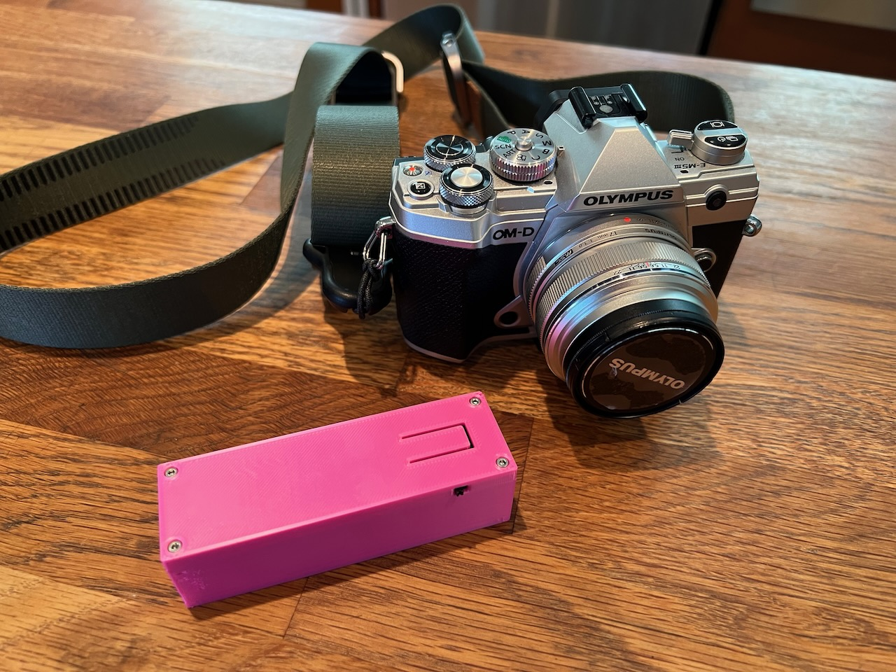
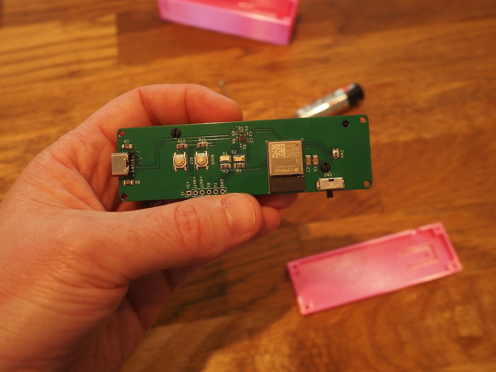
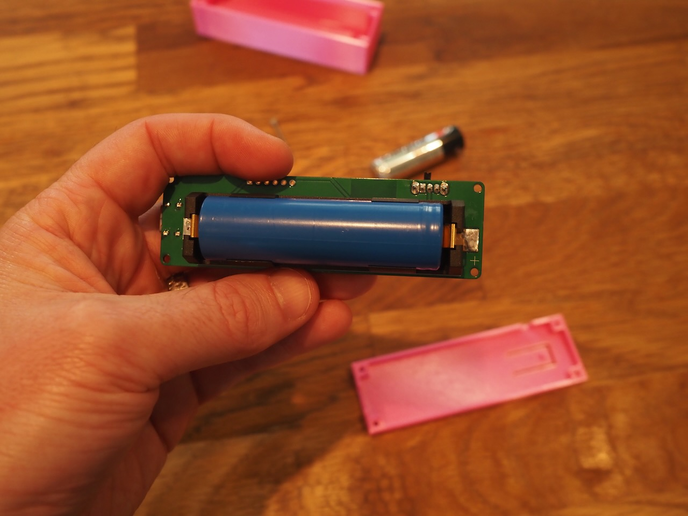
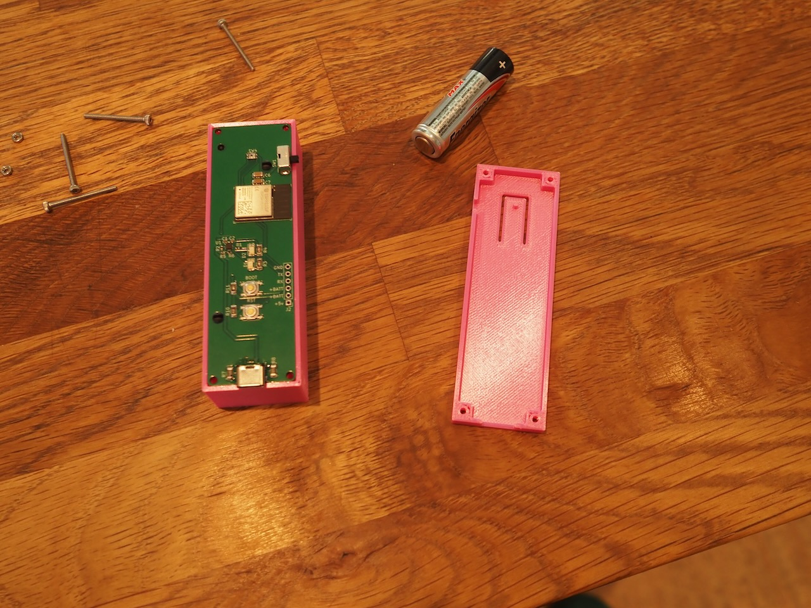

# Camera Clicker

This project is a dedicated WiFi client and remote shutter for Olympus OM-D cameras.
It simply connects to the camera, and then you can use the button to fire the camera shutter.
I've only tested this with my OM-D E-M5 Mark III camera, but I believe it will work with an OM-D camera that uses WiFi for it's remote shutter application.

<p align="center">
  
</p>

In this repository, you'll find [schematics and PCB designs](pcb), [stl files](housing), and the [firmware](firmware) you need.

## Hardware

The hardware is based around the ESP32.  It uses an [LeFePO4 battery](https://www.digikey.com/en/products/detail/zeus-battery-products/PCIFR18650-1500/9828824) to provide power to the ESP32.
I chose this battery because it provides 3.2v which means I don't need a voltage regulator for the ESP32.
The schematic integrates a recharging circuit, so you can recharge the battery via USB C.

Below are the necessary parts:

| Quantity | Part | Size | Value |
| -------- | ---- | ---- | ----- |
| 1 | [Battery Holder](https://www.digikey.com/en/products/detail/keystone-electronics/1042/2745668) | BatteryHolder_Keystone_1042_1x18650 | |
| 1 | [Battery](https://www.digikey.com/en/products/detail/zeus-battery-products/PCIFR18650-1500/9828824) | | |
| 2 | Capacitor | 0402 | 1uf |
| 1 | Capacitor | 1206 | 22uf |
| 1 | Capacitor | 1206 | 0.1uf |
| 2 | LED | 1206 | |
| 1 | [USB C connector](https://www.digikey.com/en/products/detail/amphenol-cs-fci/10164359-00011LF/18443702) | USB_C_Receptacle_Amphenol_10164359-3A | |
| 1 | Resistor | 0402 | 82k |
| 1 | Resistor | 0402 | 3k |
| 4 | Resistor | 1206 | 10k |
| 1 | Resistor | 0402 | 70k |
| 1 | Resistor | 0402 | 2.3k |
| 2 | Resistor | 1206 | 5.1k |
| 1 | [Power Switch](https://www.digikey.com/en/products/detail/te-connectivity-alcoswitch-switches/1825232-1/4021554) | | |
| 2 | [Programming Switches](https://www.digikey.com/en/products/detail/c-k/PTS526-SK15-SMTR2-LFS/10056626) | SW_SPST_PTS526 | |
| 1 | [Double Action Switch](https://www.digikey.com/en/products/detail/panasonic-electronic-components/EVP-AXBA1A/4930566) | EVPAX-A1A | |
| 1 | NTC Thermistor | 1206 | 10k NTC |
| 1 | [Battery Charger](https://www.digikey.com/en/products/detail/texas-instruments/BQ25170DSGR/14124032) | WSON-8-1EP_2x2mm_P0.5mm_EP0.9x1.6mm | BQ25170 |
| 1 | [ESP32](https://www.digikey.com/en/products/detail/espressif-systems/ESP32-MINI-1-N4/13532111) | | |

You'll find the gerber files in the [pcb folder](pcb).
Also, I used 10k resistors for the LEDs, but I think it made the LEDs too dim, so maybe 1k is better.
The LEDs are used to indicate charging status, so I don't think they actually matter too much.

Here's a couple photos of the finished PCB:

<p align="center">
   
</p>

## Firmware

The firmware is in the [firmware](firmware) folder.  It's a standard [ESP IDF](https://github.com/espressif/esp-idf) project.
In order to flash the ESP32, I used a [POGO Pin Clip](https://www.adafruit.com/product/5433) connected to a [USB to Serial](https://www.sparkfun.com/products/12731) board.

Once you have `esp-idf` installed, you can install the firmware like this:

```
$ idf.py build flash
```

Of course, make sure to press the BOOT and RST buttons to put the ESP32 in to programming mode.

## Housing

You can find STL files for the housing in the [housing](housing) folder.
Just print [`top.stl`](housing/top.stl) and [`bottom.stl`](housing/bottom.stl) and the PCB should fit inside.
The housing requires four M2 x 25mm bolts, and four 4mm hex nuts.

The PCB should fit in the housing like this:

<p align="center">
  
</p>
